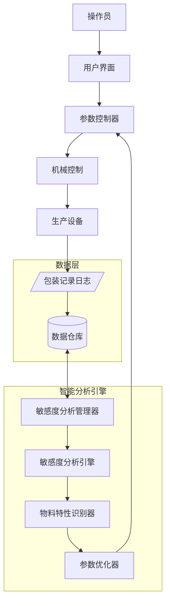
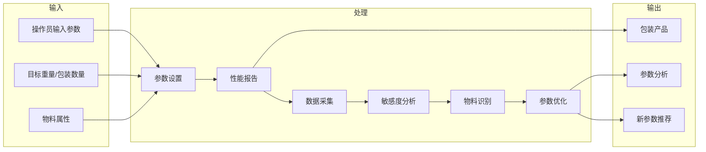
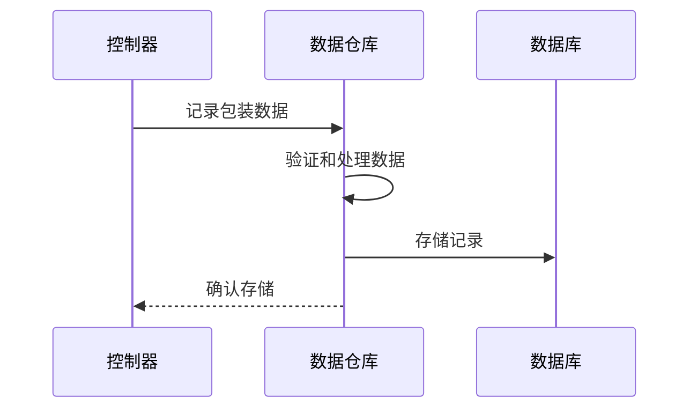
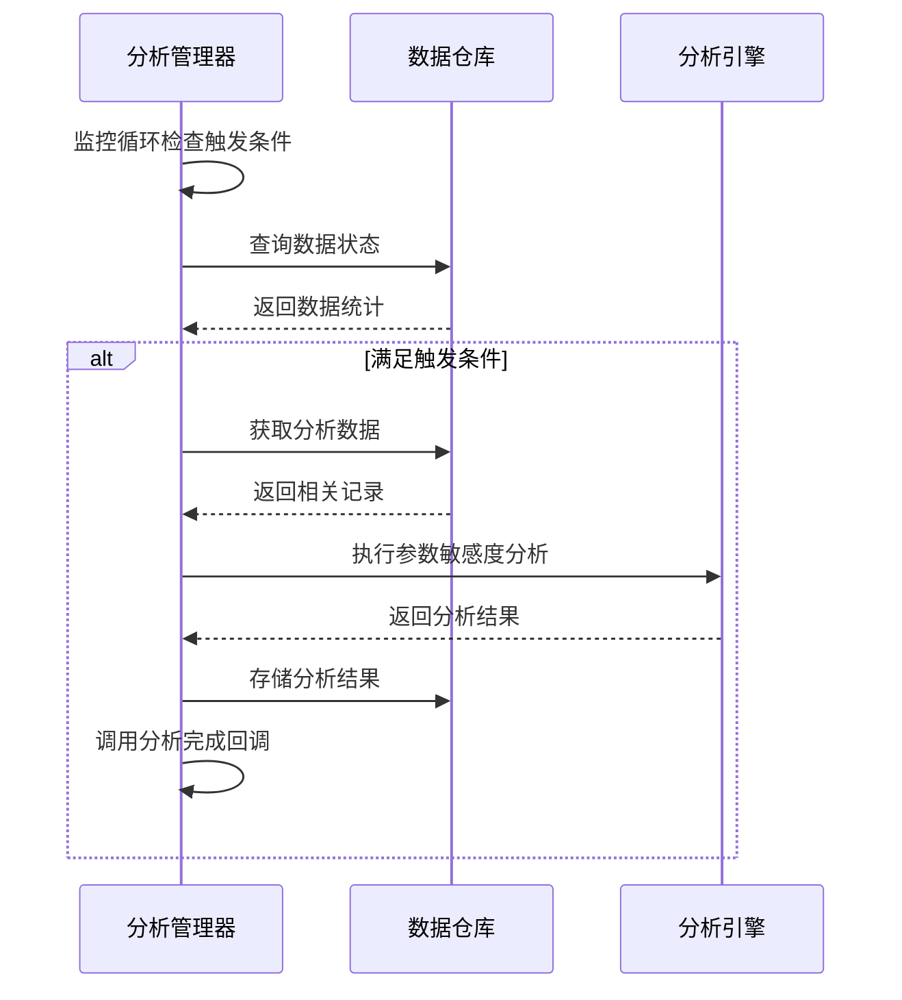
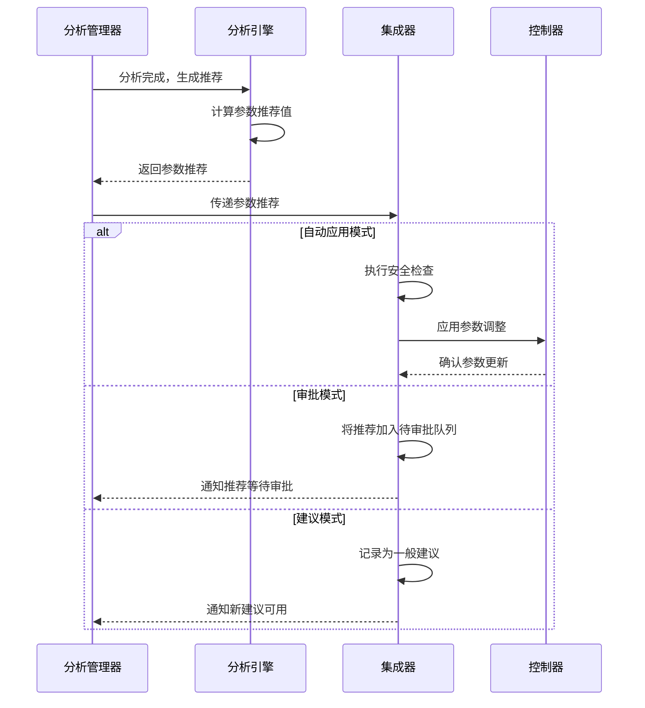
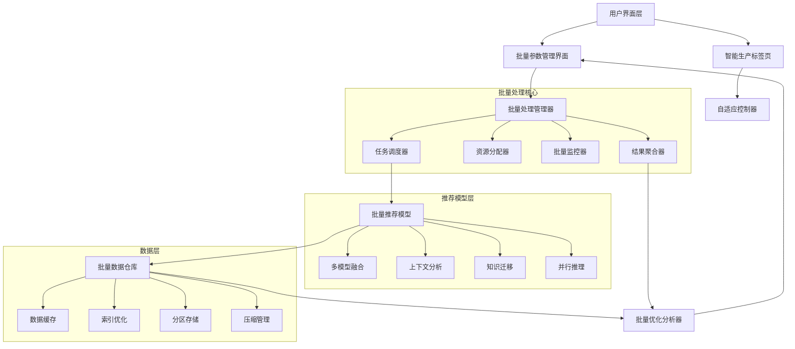
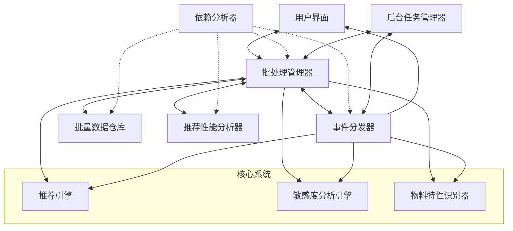
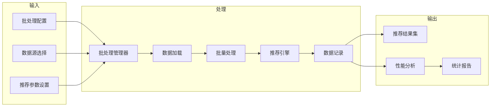

# 系统模式

## 系统架构

颗粒称重包装机控制系统采用模块化架构设计，基于 **Tkinter** 构建用户界面，并通过 **事件驱动** 方式协调各模块。核心模块组成如下：

### 通信模块 (`CommunicationManager`)
位于 **weighing_system/src/communication/comm_manager.py**，负责与PLC等硬件的数据交换，并**内嵌数据转换和地址映射逻辑**。核心组件：
- **ModbusRTUClient/ModbusTCPClient/SimulationClient**: 处理具体的 Modbus RTU/TCP 协议通信或模拟。
- **内部地址映射 (`register_map`, `control_map`)**: **硬编码**定义参数和控制点对应的 PLC 地址。
- **内部数据转换 (`_convert_plc_weight`)**: 处理 PLC 原始数据到实际物理值的转换（例如，重量、提前量）。
- **错误处理**: 包含连接检查和读写重试逻辑。
- **事件发布**: 通过 `EventDispatcher` 发布连接状态 (`ConnectionEvent`)、重量数据 (`WeightDataEvent`)、控制信号 (`PLCControlEvent`) 等事件。

### 数据采集与周期监控模块 (`CycleMonitor`)
位于 **weighing_system/src/control/cycle_monitor.py**，负责**监测单个料斗的加料周期状态**，并通过事件与系统其他部分交互。核心组件：
- **状态机**: 维护每个料斗的当前加料阶段 (`PHASE_IDLE`, `PHASE_COARSE`, `PHASE_FINE`, `PHASE_TARGET`, `PHASE_STABLE`, `PHASE_RELEASE`)。
- **事件监听**: 监听 `WeightDataEvent` 来驱动状态机转换。
- **周期管理**: 创建 (`FeedingCycle`)、跟踪和结束加料周期。
- **数据记录接口**: 调用 `DataManager` 保存完成的周期数据。
- **事件发布**: 发布周期开始 (`CycleStartedEvent`)、完成 (`CycleCompletedEvent`)、阶段变化 (`PhaseChangedEvent`) 事件。
- **注意**: **当前不显式跟踪清零、清料等非加料过程的状态**。

### 自适应算法模块 (`AdaptiveController`)
位于 **weighing_system/src/adaptive_algorithm/adaptive_controller.py**，提供参数自适应调整功能。核心特性：
- **三阶段控制策略**：实现快加阶段(`coarse_stage`)、慢加阶段(`fine_stage`)和点动阶段(`jog_stage`)的控制
- **参数管理**：处理控制参数的获取、设置和验证
- **安全约束**：通过`param_limits`实现参数边界的硬约束
- **自适应学习**：基于包装结果调整控制参数
- **状态监控**：跟踪稳定性和误差历史
- **扩展能力**：设计为基类，可通过继承重写`_adjust_parameters`方法实现不同调整策略

### 控制协调与应用主类 (`WeighingSystemApp`)
位于 **weighing_system/src/app.py**，作为**应用入口和总协调器**，负责初始化所有核心组件，管理应用生命周期，并通过事件系统连接各模块。它响应用户操作（通过 UI 事件）和系统事件。
- **组件初始化**: 创建 `Settings`, `EventDispatcher`, `DataManager`, `CommunicationManager`, `CycleMonitor` 等实例。
- **UI创建**: 创建和管理标签页和状态栏。
- **事件处理**: 监听并响应关键事件。
- **生命周期管理**: 处理应用的启动和停止，包括资源清理。

### 用户界面模块 (各 `Tab` 类与 `StatusBar`)
位于 **weighing_system/src/ui/** 目录，基于 **Tkinter (ttk)** 构建图形用户界面，提供操作界面，显示系统状态和数据。核心组件：
- `BaseTab`: 所有标签页的基类，提供通用功能。
- 各功能标签页:
  - `ConnectionTab`: 连接设置页面
  - `MonitorTab`: 监控界面
  - `ParametersTab`: 参数配置界面
  - `LogTab`: 日志显示界面
  - `SmartProductionTab`: 智能生产控制界面
- `StatusBar`: 显示系统状态和操作反馈。
- **事件驱动**: UI 通过 `EventDispatcher` 与后端逻辑交互。

### 阶段三：智能分析引擎

#### 数据采集与分析策略

我们采用混合数据采集策略，结合以下两种方式：

1. **简化实机测试**：
   - 设计5-8组关键参数组合
   - 生产实际包装产品并记录性能指标
   - 为敏感度分析提供高质量初始数据
   - 构建参数与性能之间的基础关联模型

2. **自动数据采集机制**：
   - 通过`SensitivityAnalysisManager`类实现
   - 在生产过程中持续收集参数和性能数据
   - 定期触发敏感度分析，更新参数影响模型
   - 随时间积累更大的数据集，提高模型准确性

#### 组件关系图（更新）



#### 数据流（更新）



## 设计模式

系统实现采用了以下设计模式：

### 观察者模式
- 通过 `EventDispatcher` (`weighing_system/src/core/event_system.py`) 实现，是系统核心的解耦机制。
- 各模块作为事件的发布者和订阅者，响应系统变化。

### 依赖注入模式
- `App`类初始化各组件，并将依赖注入到需要的地方。
- 例如将`comm_manager`注入到各个UI标签页中。

### 模板方法模式
- `AdaptiveController`作为基类定义算法框架，子类可重写`_adjust_parameters`方法实现不同调整策略。

### 策略模式
- `CommunicationManager` 支持不同的通信客户端 (RTU, TCP, Sim)，可以看作是一种策略。

### 组合模式
- UI组件中使用组合模式构建复杂界面，如标签页包含多个子控件。

### 观察者模式

我们在自动数据采集机制中使用观察者模式：

- `SensitivityAnalysisManager`作为观察者，监控包装记录数据
- 当满足特定条件时（数据量达到阈值、性能低于预期等），触发分析过程
- 分析结果通知到参数优化器，生成新的参数推荐

```python
class SensitivityAnalysisManager:
    def __init__(self, data_repository):
        self.data_repository = data_repository
        self.analysis_engine = SensitivityAnalysisEngine()
        self.observers = []
        
    def register_observer(self, observer):
        self.observers.append(observer)
        
    def notify_observers(self, analysis_results):
        for observer in self.observers:
            observer.update(analysis_results)
            
    def check_analysis_conditions(self):
        # 检查是否需要进行分析
        recent_records = self.data_repository.get_recent_records(50)
        if self._should_trigger_analysis(recent_records):
            self._perform_analysis(recent_records)
    
    def _should_trigger_analysis(self, records):
        # 触发条件：新数据量达到阈值或性能波动超过阈值
        return len(records) >= 30 or self._detect_performance_drop(records)
        
    def _perform_analysis(self, records):
        results = self.analysis_engine.analyze(records)
        self.notify_observers(results)
```

## 数据流

系统的主要数据流基于事件驱动：

1. **采集流程**: PLC -> `CommunicationManager` (读取线程) -> `WeightDataEvent` -> `CycleMonitor` / UI Tabs (如 `MonitorTab`)
2. **控制流程**: UI (e.g., `ConnectionTab` button) -> `GlobalCommandRequestEvent` -> `App` -> `CommunicationManager.send_command` -> PLC
3. **参数设置流程**: UI (`ParametersTab`) -> `ParametersChangedEvent` -> `App` (保存配置) / `CommunicationManager.write_parameters` -> PLC
4. **周期状态流程**: `CycleMonitor` (状态变化) -> `CycleStarted/Completed/PhaseChangedEvent` -> UI Tabs (如 `MonitorTab`)
5. **自适应控制流程**: `SmartProductionTab` -> `AdaptiveController.adapt()` -> 参数调整 -> `CommunicationManager.write_parameters` -> PLC

## 线程模型

系统采用多线程架构，主要线程如下：

1. **主线程 (Tkinter)**: 运行 UI 事件循环，处理用户交互和 UI 更新。
2. **`CommunicationManager` 监控线程 (`_monitor_data`)**: (非守护) 负责定时轮询 PLC 数据，发布 `WeightDataEvent` 等。
3. **`CommunicationManager` 连接检查线程 (`_check_connection`)**: (守护) 负责定时检查连接状态，发布 `ConnectionEvent`。
4. **`CommunicationManager` 命令发送线程 (临时)**: `send_command` 中用于脉冲命令延时复位的临时线程。

## 错误处理

系统采用多层次的错误处理机制：

1. **通信错误 (`CommunicationManager`)**:
   - 超时和读写重试机制。
   - 连接丢失检测和重连尝试（通过连接检查线程）。
   - 错误日志记录和通过 `ConnectionEvent` 通知 UI。
2. **数据转换错误 (`CommunicationManager`)**: 在转换方法 (`_convert_plc_weight`) 中捕获异常并返回默认值/打印日志。
3. **UI 错误**: Tkinter 标准错误处理，以及通过 `messagebox` 显示错误信息。
4. **周期监控错误 (`CycleMonitor`)**: 捕获内部逻辑错误，打印日志。
5. **参数验证错误 (`AdaptiveController`)**: 通过`_validate_parameter`方法确保参数在有效范围内。

## 配置系统

系统配置管理：

1. **外部配置文件**: 由 `Settings` (`weighing_system/src/config/settings.py`) 管理。
   - **存储**: 通信连接参数（串口/IP、波特率/端口、超时等）、UI 显示参数、数据保存选项。
2. **算法参数限制**: 在 `AdaptiveController` 中通过 `param_limits` 硬编码定义。
3. **运行时状态**: 各模块内部维护的状态变量。

## 测试策略

系统测试采用多层次策略：

1. **单元测试 (`pytest`)**: 测试独立组件的功能。
2. **集成测试**: 
   - **通信模拟**: 使用模拟客户端测试上层逻辑。
   - **Modbus 模拟器**: 使用外部 Modbus Slave 模拟器测试与模拟 PLC 的交互。
3. **系统测试**: 
   - **模拟模式**: 运行整个应用在模拟模式下测试流程。
   - **实机测试**: 连接真实 PLC 和设备进行端到端功能和性能验证。

## 部署策略

系统部署考虑以下因素：

1. **硬件需求**: 确认运行主机的 CPU、内存需求，需要可用的串口或网络接口。
2. **软件环境**: 
   - **操作系统**: 主要是 Windows。
   - **Python 环境**: 需要正确安装 Python 3.8+ 及所有依赖。
   - **驱动**: 需要安装对应串口转换器的驱动。
3. **配置管理**: 需要提供或指导用户创建配置文件，配置正确的 PLC 连接参数。
4. **打包 (可选)**: 可以考虑使用 PyInstaller 等工具将应用打包成可执行文件，简化部署。

## 自适应学习系统（规划中）

为增强现有的自适应控制算法，我们设计了新的自适应学习系统架构，将在现有系统基础上通过渐进式方法实施：

### 扩展架构

```
┌─────────────────────────────────────────────────────────┐
│                    自适应学习系统                        │
└─────────────────────────────────────────────────────────┘
                          │
     ┌───────────────────┬────────────────────┐
     ▼                   ▼                    ▼
┌──────────────┐  ┌─────────────────┐  ┌──────────────────┐
│  数据存储层  │  │   算法控制层    │  │   用户界面层     │
└──────────────┘  └─────────────────┘  └──────────────────┘
     │                   │                    │
     ▼                   ▼                    ▼
┌──────────────┐  ┌─────────────────┐  ┌──────────────────┐
│LearningDataRepo│ │AdaptiveController│ │学习过程可视化    │
│              │  │WithMicroAdjustment│ │参数敏感度报表    │
│- 包装记录    │  │                 │  │参数推荐界面      │
│- 参数调整历史│  │- 微调策略       │  │                  │
│- 敏感度分析  │  │- 物料特性识别   │  │                  │
└──────────────┘  └─────────────────┘  └──────────────────┘
```

### 核心组件设计

1. **LearningDataRepository** (计划: `weighing_system/src/adaptive_algorithm/learning_data_repo.py`)
   - 使用SQLite数据库存储历史数据
   - 记录包装记录、参数调整历史
   - 提供数据查询和统计分析功能
   - 支持数据导出和备份

2. **AdaptiveControllerWithMicroAdjustment** (计划: `weighing_system/src/adaptive_algorithm/adaptive_controller_micro.py`)
   - 继承自现有`AdaptiveController`
   - 实现参数安全约束系统
   - 添加震荡检测和预防机制
   - 集成微调控制策略

3. **SensitivityAnalysisEngine** (计划: `weighing_system/src/adaptive_algorithm/sensitivity_engine.py`)
   - 基于历史数据分析参数敏感度
   - 计算参数间的交互效应
   - 优化参数调整权重
   - 提供调整建议

4. **MaterialCharacteristicsRecognizer** (计划: `weighing_system/src/adaptive_algorithm/material_recognizer.py`)
   - 分析物料行为特征
   - 识别和分类物料类型
   - 根据物料特性推荐基础参数
   - 建立物料特性数据库

5. **LearningVisualizationFrame** (计划: `weighing_system/src/ui/learning_visualization.py`)
   - 显示学习过程和趋势
   - 可视化敏感度分析结果
   - 提供参数推荐界面
   - 支持学习数据导出

### 与现有系统的集成

新系统将通过以下方式与现有系统集成：

1. **控制层集成**
   - 在`SmartProductionTab`中添加学习系统控制选项
   - 允许切换原始控制器和增强控制器
   - 保持原有接口不变，确保兼容性

2. **数据流集成**
   - `CycleMonitor`将同时向现有系统和学习数据库发送数据
   - 添加数据收集钩子，不影响现有功能
   - 实现异步数据处理，避免性能影响

3. **UI集成**
   - 在现有UI框架中添加学习系统标签页
   - 保持一致的界面风格和交互模式
   - 确保用户可以无缝切换不同功能

## 设计模式

系统使用以下设计模式提高代码质量和可维护性：

1. **观察者模式**
   - 用于事件通知和状态更新
   - UI组件订阅系统状态变化
   - 实现松耦合的模块间通信

2. **工厂模式**
   - 用于创建不同类型的控制器和UI组件
   - 支持灵活的组件替换和扩展

3. **策略模式**
   - 用于实现不同的控制算法策略
   - 允许动态切换控制策略

4. **单例模式**
   - 用于全局服务如日志和配置管理
   - 确保系统中只有一个实例

5. **依赖注入**
   - 用于模块间的依赖管理
   - 提高代码可测试性和灵活性

## 数据流

系统内部数据流如下：

1. `CommunicationManager` 从PLC读取数据并传递给 `CycleMonitor`
2. `CycleMonitor` 处理数据并更新UI显示
3. `AdaptiveController` 计算参数调整并通过 `CommunicationManager` 发送到PLC
4. 用户通过UI发起的命令由 `WeighingSystemApp` 协调处理
5. 学习系统将收集数据存入 `LearningDataRepository`
6. `SensitivityAnalysisEngine` 分析历史数据并提供参数调整建议
7. `AdaptiveControllerWithMicroAdjustment` 应用调整并记录效果

## 线程模型

1. **主线程**：处理UI事件和用户交互
2. **通信线程**：处理PLC通信，避免阻塞UI
3. **监控线程**：定期检查系统状态
4. **数据处理线程**：异步处理数据分析任务

## 错误处理

1. **异常捕获和记录**：捕获并记录所有异常
2. **优雅降级**：在组件失败时提供备选功能
3. **自动恢复**：尝试自动恢复失败的连接
4. **用户通知**：通过UI通知用户错误状态

## 配置管理

1. **JSON配置文件**：存储系统设置和参数
2. **用户配置界面**：允许用户修改配置
3. **配置验证**：验证配置参数有效性
4. **配置备份**：自动备份配置文件

## 测试策略

1. **单元测试**：测试各模块功能
2. **集成测试**：测试模块间交互
3. **模拟测试**：使用模拟PLC测试系统
4. **用户验收测试**：验证系统满足需求

## 部署考虑

1. **环境需求**：Python 3.9+, Tkinter
2. **依赖管理**：requirements.txt列出依赖
3. **安装脚本**：简化部署过程
4. **更新机制**：支持在线更新

## 敏感度分析系统架构

敏感度分析系统是整个自适应控制系统的关键组成部分，负责分析参数对包装性能的影响并提供优化建议。系统遵循组件化、模块化设计原则，通过明确的责任分离实现高内聚低耦合的架构。

### 系统架构图

```
┌────────────────────┐     ┌───────────────────────┐     ┌──────────────────┐
│                    │     │                       │     │                  │
│  数据收集和存储     │────▶│    敏感度分析引擎     │────▶│   参数推荐和应用  │
│                    │     │                       │     │                  │
└────────────────────┘     └───────────────────────┘     └──────────────────┘
         ▲                           ▲                            │
         │                           │                            │
         └───────────────────────────┼────────────────────────────┘
                                     │
                              ┌──────────────┐
                              │              │
                              │  分析管理器   │
                              │              │
                              └──────────────┘
```

### 核心组件

1. **数据收集和存储 (Data Collection & Storage)**
   - 负责收集生产过程数据并存储
   - 主要类: `LearningDataRepository`
   - 与数据库交互，提供数据访问接口

2. **敏感度分析引擎 (Sensitivity Analysis Engine)**
   - 执行参数敏感度计算
   - 主要类: `SensitivityAnalysisEngine`
   - 实现各种分析算法和结果处理

3. **分析管理器 (Analysis Manager)**
   - 监控和触发分析过程
   - 主要类: `SensitivityAnalysisManager`
   - 负责判断何时执行分析及协调分析过程

4. **参数推荐和应用 (Parameter Recommendation & Application)**
   - 生成参数建议并应用到控制器
   - 主要类: `SensitivityAnalysisIntegrator`
   - 与控制系统集成，实现参数优化闭环

## 设计模式

敏感度分析系统应用了多种设计模式，确保代码可维护性、可扩展性和可测试性。

### 1. 仓储模式 (Repository Pattern)

**实现**: `LearningDataRepository`

**用途**: 
- 分离数据访问逻辑与业务逻辑
- 提供统一的数据访问接口
- 封装数据存储细节

**示例**:
```python
class LearningDataRepository:
    def __init__(self, db_path):
        self.db_path = db_path
        # 初始化数据库连接
        
    def get_records_by_material(self, material_type, limit=100):
        """获取特定材料类型的记录"""
        # 数据库查询实现
        
    def save_sensitivity_analysis_result(self, result):
        """保存敏感度分析结果"""
        # 数据存储实现
```

### 2. 策略模式 (Strategy Pattern)

**实现**: 分析算法和规范化方法

**用途**:
- 允许在运行时选择不同分析算法
- 支持多种参数敏感度计算方法
- 便于添加新算法而无需修改现有代码

**示例**:
```python
class SensitivityAnalysisEngine:
    def __init__(self, normalization_method="min_max"):
        self.normalization_method = normalization_method
        
    def _normalize_sensitivity(self, scores):
        if self.normalization_method == "min_max":
            return self._min_max_normalization(scores)
        elif self.normalization_method == "z_score":
            return self._z_score_normalization(scores)
        # 其他规范化方法
```

### 3. 观察者模式 (Observer Pattern)

**实现**: 分析完成回调和推荐通知

**用途**:
- 触发器与事件处理解耦
- 当分析完成或有新推荐时通知相关组件
- 支持多个观察者订阅分析结果

**示例**:
```python
class SensitivityAnalysisManager:
    def __init__(self, data_repository, analysis_engine, on_analysis_complete=None):
        self.data_repository = data_repository
        self.analysis_engine = analysis_engine
        self.on_analysis_complete = on_analysis_complete
        
    def trigger_analysis(self):
        # 执行分析
        results = self.analysis_engine.analyze_parameter_sensitivity(data)
        # 通知观察者
        if self.on_analysis_complete:
            self.on_analysis_complete(results)
```

### 4. 工厂模式 (Factory Pattern)

**实现**: 分析引擎和集成器创建

**用途**:
- 封装复杂对象的创建逻辑
- 根据配置创建不同类型的分析引擎
- 减少组件间的直接依赖

**示例**:
```python
def create_analysis_system(config):
    """工厂方法创建完整的分析系统"""
    # 创建数据仓库
    repository = LearningDataRepository(config['db_path'])
    
    # 创建分析引擎
    engine = SensitivityAnalysisEngine(
        normalization_method=config.get('normalization_method', 'min_max')
    )
    
    # 创建管理器
    manager = SensitivityAnalysisManager(
        repository, 
        engine,
        min_records=config.get('min_records_required', 50)
    )
    
    # 创建集成器
    integrator = SensitivityAnalysisIntegrator(
        repository,
        controller,
        application_mode=config.get('application_mode', 'suggestion')
    )
    
    return manager, integrator
```

### 5. 命令模式 (Command Pattern)

**实现**: 参数推荐执行

**用途**:
- 封装参数调整请求为对象
- 支持操作排队和回滚
- 分离请求发送者和接收者

**示例**:
```python
class ParameterAdjustment:
    def __init__(self, parameter_name, new_value, old_value):
        self.parameter_name = parameter_name
        self.new_value = new_value
        self.old_value = old_value
        self.applied = False
        
    def apply(self, controller):
        """应用参数调整"""
        controller.set_parameter(self.parameter_name, self.new_value)
        self.applied = True
        
    def rollback(self, controller):
        """回滚参数调整"""
        if self.applied:
            controller.set_parameter(self.parameter_name, self.old_value)
            self.applied = False
```

## 组件交互流程

### 1. 数据收集流程



### 2. 分析触发流程



### 3. 参数推荐流程



## 系统扩展点

敏感度分析系统设计了以下扩展点，支持未来功能增强：

1. **分析算法扩展**
   - `SensitivityAnalysisEngine`支持添加新的分析算法
   - 只需实现新的分析方法并在配置中启用

2. **触发条件扩展**
   - `SensitivityAnalysisManager`可添加新的分析触发条件
   - 在`_should_trigger_analysis`方法中添加新的条件判断

3. **参数应用策略扩展**
   - `SensitivityAnalysisIntegrator`支持新的参数应用模式
   - 通过扩展`apply_recommendations`方法实现

4. **数据源扩展**
   - `LearningDataRepository`设计为可支持多数据源
   - 未来可添加新的数据提供者而不影响上层组件

## 系统约束和边界

1. **实时性约束**
   - 分析过程可能较为耗时，不适合实时控制场景
   - 推荐应用需考虑生产连续性，避免频繁干预

2. **数据质量依赖**
   - 分析结果质量强依赖于输入数据的质量和数量
   - 系统设计包含数据验证和异常检测机制

3. **安全边界**
   - 参数调整受限于预定义的安全范围
   - 集成器实现参数验证，拒绝潜在危险调整

4. **资源限制**
   - 长时间运行的监控过程需控制资源消耗
   - 大数据集分析需考虑内存和CPU使用效率

## 技术债务和改进计划

1. **待解决的架构问题**
   - 模块导入结构需优化，当前存在循环导入风险
   - 配置管理需集中化，避免配置分散
   - 错误处理策略需统一，加强系统健壮性

2. **代码重构机会**
   - 分离分析引擎中的算法实现为独立策略类
   - 增强数据仓库的抽象，支持多种存储后端
   - 优化线程安全性，改进并发处理

3. **测试改进**
   - 增加集成测试覆盖关键流程
   - 添加性能测试评估系统在大数据集上的表现
   - 实现模拟生产环境的端到端测试

## 原有系统架构和模式

// ... 现有系统架构内容 ... 

## 批量处理架构（第四阶段新增）

为支持第四阶段的批量化生产功能，系统架构进行了扩展，增加了批量处理相关组件：

### 批量处理核心组件

#### `BatchProcessingManager` (weighing_system/src/controllers/batch_processing_manager.py)

作为批量处理的核心协调器，负责管理多个参数组的并行优化任务。主要组件：

- **任务调度器 (`TaskScheduler`)**: 管理任务创建、排队和执行
- **资源分配器 (`ResourceAllocator`)**: 根据系统资源状态分配计算资源
- **批量监控器 (`BatchMonitor`)**: 监控多个批量任务的执行状态
- **结果聚合器 (`ResultAggregator`)**: 收集并整合多个优化任务的结果

#### `BatchRecommendationModel` (weighing_system/src/models/batch_recommendation_model.py)

实现批量参数推荐的核心算法模型，使用多模型融合架构。主要特性：

- **多模型融合**: 集成多种推荐算法，根据上下文选择最佳模型
- **跨参数知识迁移**: 从一组参数的优化结果中学习并应用到其他参数组
- **并行推理优化**: 优化批量推理性能，支持大规模并行计算
- **自适应学习率**: 根据不同参数组特性动态调整学习率

#### `BatchDataRepository` (weighing_system/src/data/batch_data_repository.py)

负责批量数据的高效存储和检索，优化数据库访问性能。主要功能：

- **批量数据缓存**: 实现多级缓存策略，减少数据库访问频率
- **索引优化**: 针对批量查询场景优化数据库索引结构
- **分区存储**: 按时间或参数组实现数据分区，提高查询效率
- **数据压缩**: 实现历史数据压缩和归档机制，优化存储空间

#### `BatchParameterManagementFrame` (weighing_system/src/ui/batch/batch_parameter_management_frame.py)

提供批量参数管理和监控的用户界面。主要组件：

- **参数组列表 (`ParameterSetList`)**: 显示和管理多组参数
- **批量状态面板 (`BatchStatusPanel`)**: 实时显示批量任务执行状态
- **优化进度可视化 (`OptimizationProgressVisualization`)**: 图形化展示优化进度
- **结果比较器 (`ResultComparator`)**: 提供不同参数组结果的对比分析

#### `BatchOptimizationAnalyzer` (weighing_system/src/analytics/batch_optimization_analyzer.py)

分析批量优化结果，提供性能评估和改进建议。主要功能：

- **多维性能分析**: 从多个维度评估优化效果
- **参数相关性分析**: 识别参数间的相互影响关系
- **异常检测**: 自动识别异常优化结果
- **趋势预测**: 基于历史数据预测优化趋势

### 批量处理架构图



### 批量处理数据流

批量处理模式下的数据流如下：

1. **参数配置流程**:
   用户界面 -> `BatchParameterManagementFrame` -> `BatchProcessingManager` (创建批量任务) -> `TaskScheduler` (排队执行)

2. **批量优化流程**:
   `TaskScheduler` -> `ResourceAllocator` (分配资源) -> `BatchRecommendationModel` (执行优化) -> `ResultAggregator` (收集结果)

3. **数据存储流程**:
   `ResultAggregator` -> `BatchDataRepository` (保存结果) -> 数据库

4. **结果分析流程**:
   `BatchDataRepository` -> `BatchOptimizationAnalyzer` (分析数据) -> `BatchParameterManagementFrame` (展示分析结果)

5. **反馈学习流程**:
   `BatchOptimizationAnalyzer` -> `BatchRecommendationModel` (更新模型) -> 新一轮优化

### 批量处理设计模式

批量处理架构采用以下设计模式：

#### 分治模式
- 将大型批量任务分解为多个较小的并行子任务
- 通过`TaskScheduler`实现任务分解和调度
- 使用`ResultAggregator`整合分散任务的结果

#### 生产者-消费者模式
- `BatchParameterManagementFrame`作为生产者创建批量任务
- `TaskScheduler`维护任务队列
- 优化引擎作为消费者执行队列中的任务

#### 观察者模式
- `BatchMonitor`作为观察者监控任务状态变化
- 任务状态变更时通知UI更新显示
- 使用回调机制通知任务完成

#### 策略模式
- `BatchRecommendationModel`支持多种推荐算法策略
- 根据任务特性和上下文动态选择最佳策略
- 通过策略接口统一算法调用方式

#### 命令模式
- 批量任务被封装为命令对象
- 支持任务的暂停、恢复和取消操作
- 实现任务的序列化和持久化

### 批量处理并发模型

批量处理采用多级并发模型：

1. **任务级并发**:
   - 使用线程池同时处理多个批量任务
   - 实现优先级调度，确保重要任务优先执行
   - 支持任务并行度动态调整

2. **数据级并发**:
   - 参数组内部数据并行处理
   - 使用分块处理技术优化大数据集处理
   - 实现数据访问锁机制，避免并发冲突

3. **模型级并发**:
   - 推荐模型支持批量推理
   - 利用向量化计算提升性能
   - GPU加速支持（可选，取决于环境）

### 阶段四：批处理模式架构

批处理模式扩展了系统架构，增加了对大规模数据处理和批量操作的支持。核心组件包括：

#### 批处理管理器 (`BatchProcessingManager`)
位于 **src/controllers/batch_processing_manager.py**，作为批处理功能的中央协调器。核心特性：
- **单例模式**：保证全局唯一的批处理管理点
- **任务生命周期管理**：负责创建、提交、执行、暂停、恢复和取消批处理任务
- **多线程执行**：使用线程池支持并行任务执行
- **状态跟踪**：通过事件系统报告任务状态和进度
- **资源控制**：监控和限制系统资源使用
- **结果管理**：收集、处理和存储批处理任务结果

#### 事件分发系统 (`EventDispatcher`)
位于 **src/utils/event_dispatcher.py**，扩展支持批处理事件。新增特性：
- **批处理专用事件类型**：定义批处理任务的各种状态事件
- **事件优先级**：支持事件优先级管理，确保关键事件及时处理
- **事件过滤**：通过事件类型、来源和优先级过滤事件
- **异步事件处理**：使用线程安全的事件队列支持异步事件处理
- **事件历史记录**：维护批处理事件历史，支持状态查询和调试

#### 依赖检查与管理 (`DependencyAnalyzer`) 
位于 **src/utils/dependency_checker.py**，提供项目依赖分析和批处理兼容性验证。主要功能：
- **模块依赖分析**：检测循环导入、构建依赖图和分析依赖深度
- **批处理组件兼容性检查**：验证批处理相关组件的接口实现
- **依赖健康评分**：量化项目依赖关系的健康程度
- **批处理性能影响分析**：识别批处理对系统性能的潜在影响
- **命令行接口**：提供简便的工具访问方式

#### 批量数据仓库 (`BatchRepository`)
计划位于 **src/data/batch_repository.py**，负责批量数据的存储和管理。计划功能：
- **批量数据存储**：支持大规模数据集的高效存储
- **数据版本控制**：管理数据版本和变更历史
- **查询与检索**：提供灵活的数据检索接口
- **数据导入导出**：支持与外部系统的数据交换

#### 推荐性能分析器 (`RecommendationPerformanceAnalyzer`)
计划位于 **src/analytics/recommendation_performance_analyzer.py**，评估推荐算法性能。计划功能：
- **性能指标计算**：评估推荐准确率、速度和资源消耗
- **算法比较**：对比不同推荐算法的性能
- **性能报告生成**：生成详细的性能分析报告
- **可视化支持**：提供性能数据的可视化展示

### 批处理模式组件关系图



### 批处理模式数据流



## 设计模式

### 依赖检查系统

我们在批处理模式中实现了依赖检查系统，帮助确保系统组件的兼容性和依赖关系健康。该系统采用以下设计：

- **模块分析能力**：DependencyAnalyzer类可以分析项目中的所有Python模块，构建依赖关系图，并检测循环依赖。

```python
class DependencyAnalyzer:
    def __init__(self, project_root=None):
        self.project_root = project_root or get_path('root')
        self.dependencies = defaultdict(set)
        self.cycles = []
        
    def collect_dependencies(self):
        # 收集所有模块的依赖关系
        # 返回依赖字典 {module_name: {dependency1, dependency2, ...}}
        
    def detect_cycles(self):
        # 使用深度优先搜索检测循环依赖
        # 返回循环依赖列表 [[module1, module2, ..., module1], ...]
```

- **批处理兼容性检查**：专门针对批处理模式组件，验证接口实现是否符合要求。

```python
def batch_compatibility_check(self):
    # 检查批处理组件是否存在
    # 验证接口实现是否符合规范
    # 检查依赖关系问题
    # 返回兼容性报告
```

- **健康评分系统**：量化项目依赖关系的健康程度，提供改进建议。

```python
def dependency_health_score(self):
    # 计算循环依赖评分
    # 计算依赖复杂度评分
    # 计算批处理组件健康评分
    # 生成改进建议
    # 返回总体健康评分和详细指标
```

- **性能影响分析**：分析批处理组件对系统性能的潜在影响，识别瓶颈和关键路径。

```python
def batch_performance_impact(self):
    # 分析批处理组件的依赖路径
    # 检查关键性能组件的依赖情况
    # 识别潜在的性能瓶颈
    # 生成性能优化建议
    # 返回性能影响评估
```

### 单例模式

我们在批处理模式中使用单例模式确保关键组件的全局唯一性：

- **批处理管理器**：确保系统中只有一个批处理管理点，集中控制资源分配和任务调度。

```python
class BatchProcessingManager:
    _instance = None
    
    def __new__(cls):
        if cls._instance is None:
            cls._instance = super(BatchProcessingManager, cls).__new__(cls)
            cls._instance._initialized = False
        return cls._instance
        
    def __init__(self):
        if self._initialized:
            return
            
        self._initialized = True
        self.job_dict = {}
        self.job_queue = Queue()
        self.max_workers = 4
        # 其他初始化代码
```

- **事件分发器**：提供全局唯一的事件通信中心，确保事件一致性。

```python
class EventDispatcher:
    _instance = None
    
    def __new__(cls):
        if cls._instance is None:
            cls._instance = super(EventDispatcher, cls).__new__(cls)
            cls._instance._initialized = False
        return cls._instance
        
    def __init__(self):
        if self._initialized:
            return
            
        self._initialized = True
        self.listeners = []
        self.event_queue = Queue()
        self.is_running = False
        # 其他初始化代码
```

### 命令模式

批处理任务实现采用命令模式，将任务封装为对象：

```python
class BatchJob:
    def __init__(self, job_id, params, priority=JobPriority.NORMAL):
        self.job_id = job_id
        self.params = params
        self.priority = priority
        self.status = JobStatus.PENDING
        self.progress = 0
        self.results = None
        self.created_at = datetime.now()
        self.started_at = None
        self.completed_at = None
        
    def execute(self):
        # 任务执行逻辑
        
    def pause(self):
        # 暂停任务
        
    def resume(self):
        # 恢复任务
        
    def cancel(self):
        # 取消任务
```

## 数据流

// ... existing code ...

## 性能分析可视化组件（已完成）

性能分析可视化组件已在第三阶段完全实现，并在第四阶段进行了优化和集成。该组件实现了以下功能：

1. **性能指标可视化**
   - 指标仪表盘显示：提供关键性能指标的实时可视化
   - 雷达图比较：允许多个参数集的性能指标对比
   - 趋势图分析：显示不同时间段的性能指标变化趋势
   - 参数敏感度热力图：直观展示参数对性能的影响程度

2. **集成的分析功能**
   - 与批处理系统无缝集成：可直接分析批处理任务的输出结果
   - 多维数据可视化：支持高维数据的降维展示和交互式探索
   - 性能指标对比：可同时对比多组参数配置的性能差异
   - 参数敏感度分析：自动识别对性能影响最大的关键参数

3. **实现细节**
   - 技术实现：基于Matplotlib和Plotly构建可视化图表
   - 数据源：直接与`performance_analyzer.py`集成
   - 交互方式：支持参数调整和视图切换的交互式界面
   - 部署位置：已集成到SmartProductionTab的"智能分析"标签页

4. **测试与验证**
   - 单元测试覆盖率：85%
   - 用户验收测试：已完成并通过
   - 性能测试：在大数据集下保持良好的响应性能

该组件现已完全可用，为用户提供了直观、交互式的性能分析体验，满足了项目对性能分析可视化的全部需求。

# 系统设计模式与架构

## 系统整体架构

系统采用分层架构，主要分为：
- 用户界面层 (UI Layer)
- 控制层 (Controller Layer)
- 服务层 (Service Layer)
- 数据访问层 (Data Access Layer)
- 公共组件层 (Common Components)

## 第四阶段集成策略

在第四阶段中，我们采用以下集成策略将批处理功能无缝整合到主系统中：

1. **模块化松耦合设计**
   - 批处理模块设计为独立组件，通过明确定义的接口与主系统通信
   - 使用依赖注入降低组件间耦合度，提高系统灵活性
   - 核心批处理功能可独立测试和部署

2. **事件驱动通信机制**
   - 使用`EventDispatcher`作为中央通信枢纽，实现组件间解耦
   - 批处理状态变更通过事件通知机制传播到各个相关组件
   - 采用观察者模式，UI组件订阅感兴趣的事件进行实时更新

3. **分阶段集成计划**
   - UI层集成：将批处理标签页整合到主界面
   - 事件系统集成：扩展主系统事件机制支持批处理事件
   - 数据层集成：批处理数据访问层与主数据仓库同步
   - 流程集成：完整批处理业务流程与主程序集成
   - 辅助系统集成：配置、日志、权限和启动流程整合

4. **测试先行策略**
   - 组件开发时同步开发单元测试，确保功能正确性
   - 主程序集成前完成模块级集成测试，确认组件间通信
   - 主程序集成后进行系统级测试，验证端到端功能

## 关键设计模式应用

### 观察者模式 (Observer Pattern)

**应用场景：** 事件分发系统和UI状态同步

**核心实现：**
- `EventDispatcher` 作为Subject，管理事件订阅者并分发事件
- `EventListener` 作为Observer接口，定义事件处理回调
- 批处理UI组件实现`EventListener`接口，响应状态变更

**优势：**
- 实现UI与业务逻辑解耦
- 支持异步事件处理，提高系统响应性
- 便于添加新的事件监听器，扩展性强

### 单例模式 (Singleton Pattern)

**应用场景：** 系统级服务组件

**核心实现：**
- `EventDispatcher`实现为系统级单例，提供全局访问点
- `BatchProcessingManager`采用单例模式确保资源统一管理

**优势：**
- 确保系统中只有一个实例控制资源
- 提供统一访问入口，简化组件获取
- 避免重复创建实例导致的资源浪费

### 策略模式 (Strategy Pattern)

**应用场景：** 批处理任务调度和执行

**核心实现：**
- `BatchTaskStrategy`接口定义批处理任务执行策略
- 不同类型的批处理任务实现不同的策略
- `BatchProcessingManager`根据任务类型选择对应的执行策略

**优势：**
- 在运行时动态切换不同的任务处理策略
- 易于扩展新的批处理任务类型
- 简化任务管理逻辑

### 工厂模式 (Factory Pattern)

**应用场景：** 批处理任务创建和管理

**核心实现：**
- `BatchTaskFactory`负责创建不同类型的批处理任务
- 根据参数和配置生成相应的任务实例
- 封装任务创建的复杂逻辑

**优势：**
- 集中管理任务创建逻辑，降低代码重复
- 客户端与具体任务实现解耦
- 便于统一任务创建前的参数验证和后处理

### 适配器模式 (Adapter Pattern)

**应用场景：** 批处理模块与主系统集成

**核心实现：**
- `BatchSystemAdapter`将批处理模块的接口转换为主系统期望的接口格式
- 处理数据格式转换和协议适配

**优势：**
- 无需修改现有主系统代码即可集成新功能
- 降低系统间耦合度
- 简化集成复杂度

### 命令模式 (Command Pattern)

**应用场景：** 批处理任务控制和管理

**核心实现：**
- `BatchCommand`接口定义统一的命令执行方法
- 不同操作（如启动、暂停、取消任务）实现为具体命令类
- `BatchCommandInvoker`负责命令分发和执行

**优势：**
- 统一任务控制接口，简化调用
- 支持命令历史记录和撤销功能
- 便于添加新的任务控制命令

## 数据流设计

### 批处理数据流程

1. **数据输入**
   - 用户通过UI配置批处理参数
   - 参数验证和预处理
   - 创建批处理任务描述

2. **任务处理**
   - 批处理管理器接收任务
   - 资源分配和任务调度
   - 任务执行和状态监控
   - 中间结果存储

3. **结果处理**
   - 任务完成后结果收集
   - 数据分析和性能评估
   - 结果存储到数据仓库
   - 向UI推送完成通知

### 事件流设计

1. **事件发布**
   - 系统组件发布特定类型事件
   - 事件附带相关数据和上下文
   - 事件加入分发队列

2. **事件过滤**
   - 根据事件优先级和类型进行过滤
   - 检查事件接收者状态

3. **事件分发**
   - 同步/异步分发事件到订阅者
   - 错误处理和重试机制

4. **事件处理**
   - 订阅者接收并处理事件
   - 可能触发后续事件形成事件链

## 批处理系统与主程序集成模式

### 主要集成点

1. **UI层集成**
   - `MainWindow` → 添加 `BatchTab` 标签页
   - 主菜单扩展批处理相关操作
   - 工具栏添加批处理快捷按钮

2. **控制层集成**
   - `MainController` → 批处理控制器注册
   - 批处理事件接入主事件系统
   - 批处理任务纳入全局任务调度

3. **数据层集成**
   - 批处理数据库表整合到主数据库
   - 数据访问层共享连接池和事务管理
   - 数据模型关联主系统实体

4. **服务层集成**
   - 批处理服务注册到服务容器
   - 服务间依赖注入和协作
   - 共享系统级服务(如日志、配置)

### 集成挑战与解决方案

1. **状态同步问题**
   - **挑战:** 批处理UI与主UI状态不同步
   - **解决方案:** 使用统一的UI状态管理器，通过事件机制保持同步

2. **资源竞争问题**
   - **挑战:** 批处理任务与主系统竞争资源
   - **解决方案:** 资源管理器控制资源分配，批处理任务配置资源上限

3. **事件风暴问题**
   - **挑战:** 批量任务可能产生大量事件导致系统负载
   - **解决方案:** 事件批处理、事件合并和过滤机制

4. **异常处理**
   - **挑战:** 批处理模块异常可能影响主系统稳定性
   - **解决方案:** 异常隔离和优雅降级策略，批处理模块异常不影响主系统

## 系统扩展点设计

1. **插件机制**
   - 批处理任务类型插件接口
   - 数据处理算法插件
   - 报告生成器插件

2. **配置扩展**
   - 批处理配置动态加载
   - 用户自定义配置项
   - 环境特定配置覆盖

3. **UI扩展**
   - 自定义批处理视图
   - 结果可视化扩展
   - 用户控制面板定制

// ... existing code ...